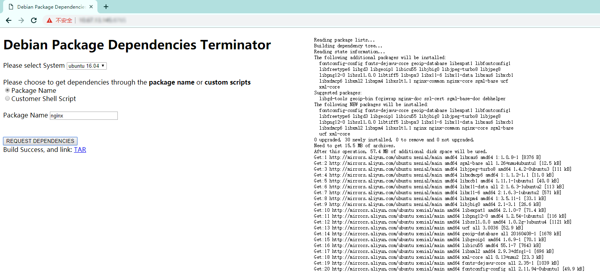

Debian Package Dependencies Terminator
==================

Purpose
----
The purpose of this tool is to get all the dependencies for offline installation of debian packages.

Principle
----
1. apt-get download the package
2. get all *.debs from /var/cache/apt/archives/, and this debs is all the dependencies of this package.

Dependencies
--------
1. python2.7
2. docker
3. nginx

Usage
--------
0. change some variable in main.py to adapt to your environment
1. run dockerfiles/createImage.sh to create docker images
2. run python main.py to start flask server
3. open http://127.0.0.1:8080/ to use this tool
4. have fun.

